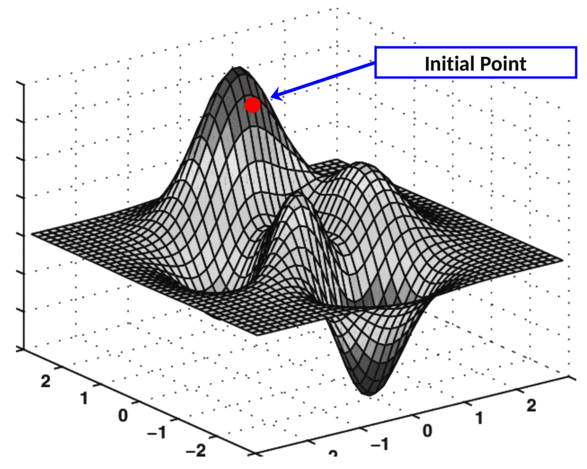

**The rise of Large Language Models (LLMs) has been a game-changer, pushing the boundaries of what AI can achieve.** But within this exciting landscape, a crucial question arises: are open-source models truly competing on equal ground with their closed-source counterparts? This blog post delves into the **hidden advantage of data ownership**, exploring the challenges faced by the open-source LLM community and offering insights into the future of this dynamic field.

In this blog post, we discuss about:

- **Why is data ownership so crucial?**
- **What does the community actually have after all?**

## **The Moat of Data Ownership**

The **secret sauce** of successful LLMs lies in the **quality and diversity of their training data**. Closed-source companies like OpenAI and Google hold the keys to these moats, granting them a unique advantage. This data advantage allows them to refine and adapt their models more effectively, potentially outperforming open-source models that rely on publicly available datasets.

### **Why is data ownership so crucial?**

It boils down to **catastrophic forgetting**, a phenomenon where models lose previously learned skills while acquiring new ones. Owning the original distribution allows these companies to fine-tune their models while minimizing this loss, essentially teaching them new tricks without compromising their core abilities.

Fig 1. Demonstrate of catastrophic forgetting problem

As we can see in the short comic, the AI which is trained only with a specific dataset (e.g information about Jan) it will change the behavior to only focus on answering everything else to Jan and starting to forgetting other topics. 

**The Gradient Descent Metaphor**
Looking deeper into more scientific about this problem,
Looking at the beginning of the AI field, every advancement comes from an algorithm called "Gradient Decent".

Fig 2. (Do we have better images to represent this?)

Look at the ball navigating a 3D space, where each axis represents different skills or knowledge it has learned. When we train the model on a new task (Case A), it's like pushing the ball towards a specific point representing that task. But this can cause it to roll away from other areas, forgetting previously learned skills - that's catastrophic forgetting.

The secret sauce of big corporations with their original data (Case B) is like having a map of this 3D space. They can push the ball towards new tasks while also using the map to avoid rolling off cliffs and forgetting old knowledge. This "map" is the diverse and balanced dataset that acts as an anchor, preventing the model from veering too far off course.

## **What does the community actually have after all?**

### **The Reality of Open-Source LLMs**

While the open-source community boasts impressive fine-tuned variant models from Llama-2 or Mistral, we are still building things on their weights and don’t own the original distribution. They created for us the feeling we are owning everything from data sources to the models but after all we all care about the best model or in fact the model which can serve our need. We can see many of the controversy between open-source models surpass ChatGPT on some benchmarks 

but quote Karpathy’s statement “I pretty much only trust two LLM evals right now: Chatbot Arena and r/LocalLlama comments section”. In the Chatbot Arena, we don’t really see many open-source models. For further detailed result table in elo ranking please see the full leaderboard [here](https://chat.lmsys.org/)

Table 1. On top 5 of the **Chatbot Arena Leaderboard -** the elo ranking system for LLM based on human preferences, we only have Qwen is a "open-source" model

| Rank | Model               | Arena Elo | License       |
|------|---------------------|-----------|---------------|
| 1    | GPT-4-1106-preview  | 1254      | Proprietary   |
| 2    | Bard (Gemini Pro)   | 1218      | Proprietary   |
| 3    | Mistral Medium      | 1152      | Proprietary   |
| 4    | Qwen1.5-72B-Chat    | 1147      | Qianwen LICENSE |
| 5    | Claude-2.0          | 1132      | Proprietary   |

*Note: we keep only the best performance model of each organization*

### **Data quality matters:**

Open-source projects often struggle with access to the vast, curated datasets that underpin big companies' LLMs. This can significantly impact model performance and capabilities. Even though thanks to big effort from the community, we have some open-source with high quality dataset like openhermes, intel orca dpo,… but after using those datasets, where can we find the next quality tokens?

### **Computational resources:**

Training LLMs requires immense computational power, which can be a significant cost barrier for smaller institutions. Big companies often have dedicated infrastructure and resources for this. Even LoRA - a finetuing method could reduce the size of the update matrices by a factor of up to several thousand is popular these day, it remains several problems. With the small amount of data, we can’t really create a chatbot to serve our personal need with the best.

Moreover, don’t have enough compute resource could also lead to the problem of creating the next tokens. We can’t create synthetic data for our tasks.

Overall, community are in the position where we are feeling like we owning everything but nothing.

## The spark of open data loop

Institutions like AllenAI with their Dolma dataset and projects like Pythia open up their pretraining datasets. Although the quality cannot yet compare with OpenAI's, these valuable datasets could improve open-source models in the next iterations.

